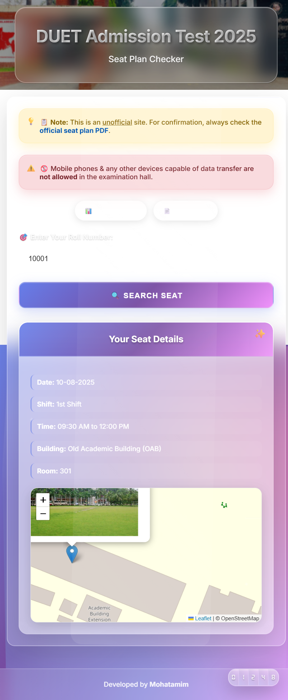
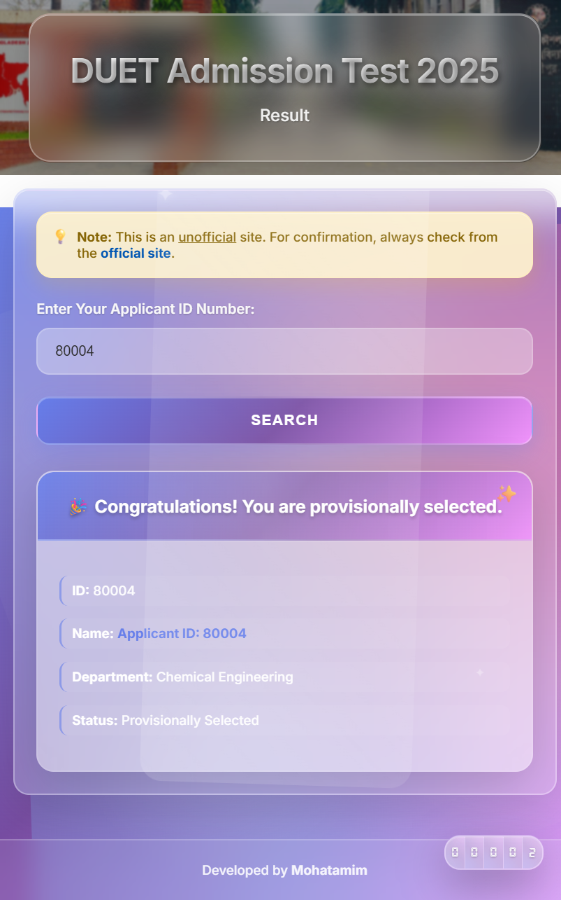
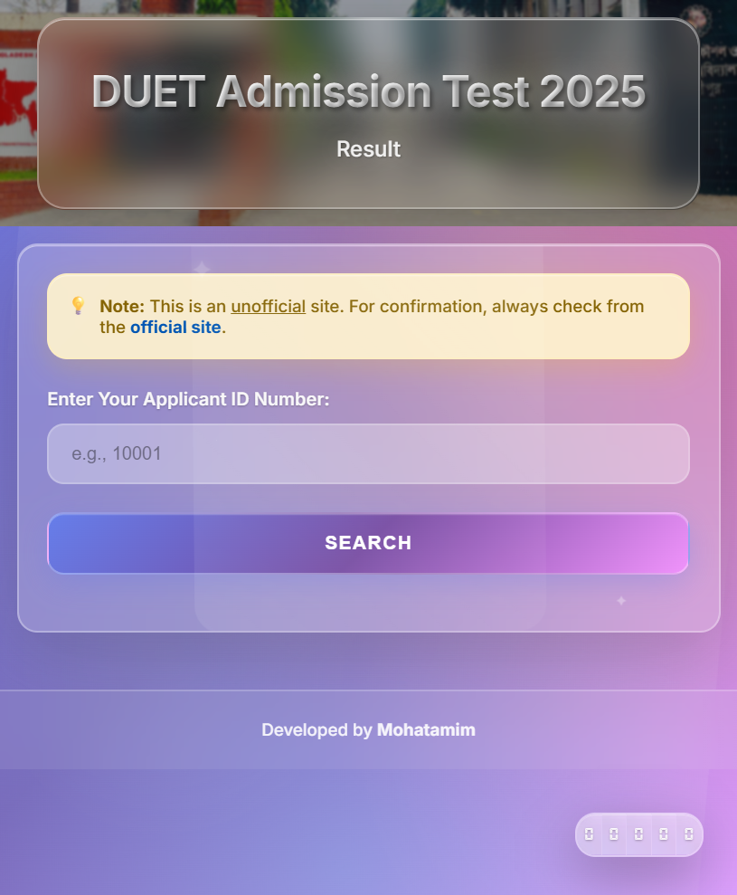

# 🎓 DUET Admission Test 2025 - Seat Plan & Result Checker

[](https://opensource.org/licenses/MIT)
[](https://developer.mozilla.org/en-US/docs/Web/HTML)
[](https://developer.mozilla.org/en-US/docs/Web/CSS)
[](https://developer.mozilla.org/en-US/docs/Web/JavaScript)
[](https://leafletjs.com/)

> A beautiful, modern web application for checking DUET (Dhaka University of Engineering & Technology) admission test seat plans and results with stunning glass morphism design.

## 📸 Screenshots

### 🏠 Main Seat Plan Checker

*Modern glass morphism design with animated backgrounds and interactive search*

### � Search Results Display

*Beautiful result cards with detailed seat information and interactive maps*

### 📊 Result Checker Interface  

*Clean and intuitive result checking interface*

### 📱 Mobile Responsive Design

*Fully responsive design optimized for all devices*

### 🗺️ Interactive Map Feature

*Integrated Leaflet.js maps showing building locations*

## ✨ Features

### 🎨 **Modern Glass Morphism UI**
- ✅ Stunning translucent glass effects with backdrop blur
- ✅ Animated gradient backgrounds with floating particles
- ✅ Smooth transitions and micro-interactions
- ✅ Professional glassmorphism aesthetic with magical borders

### 🔍 **Dual Functionality**
- ✅ **Seat Plan Checker**: Find your examination seat details by roll number
- ✅ **Result Checker**: Check admission test results by application ID
- ✅ Interactive map integration showing exact building locations
- ✅ Real-time search with instant results and loading animations

### 🚀 **Performance & Architecture**
- ✅ **Zero Backend**: Pure vanilla JavaScript implementation
- ✅ **No Database**: Fast JSON-based data processing
- ✅ **Offline Capable**: Works without internet after initial load
- ✅ **Lightning Fast**: No external API calls or server dependencies
- ✅ **Privacy First**: All data processed locally, no tracking

### 🎭 **Visual Effects & Animations**
- ✅ Animated visitor counter with smooth digit flip effects
- ✅ Floating star particles and ambient lighting effects
- ✅ Shimmer effects and glowing borders
- ✅ Smooth hover animations and 3D transformations
- ✅ Loading states with beautiful transitions

### 📱 **Responsive & Accessible**
- ✅ Mobile-optimized responsive design
- ✅ Keyboard navigation support
- ✅ Touch-friendly interface
- ✅ Cross-browser compatibility

## 🛠️ Technology Stack

- **Frontend**: HTML5, CSS3, Vanilla JavaScript (ES6+)
- **Styling**: Custom CSS with advanced glassmorphism effects
- **Maps**: Leaflet.js for interactive building location display
- **Data**: Static JSON files for fast local processing
- **Storage**: LocalStorage for visitor counting
- **Icons**: Unicode emojis and custom CSS animations
- **Fonts**: Google Fonts (Oswald, Inter, DS-Digital)

## 🚀 Getting Started

### Prerequisites
- A modern web browser (Chrome 90+, Firefox 88+, Safari 14+, Edge 90+)
- Local web server (optional, for development)

### 📦 Installation Methods

#### Option 1: Direct Download
1. **Download the repository**
   ```bash
   # Clone the repository
   git clone https://github.com/mohatamimhaque/duet-admission-2025.git
   cd duet-admission-2025
   ```

2. **Open directly in browser**
   - Simply double-click `index.html` to open in your default browser
   - Or right-click → Open with → Your preferred browser

#### Option 2: Local Development Server (Recommended)

**Using Python:**
```bash
# Python 3.x
python -m http.server 8000

# Python 2.x
python -m SimpleHTTPServer 8000
```

**Using Node.js:**
```bash
# Install globally
npm install -g http-server
http-server

# Or using npx (no installation needed)
npx http-server
```

**Using PHP:**
```bash
php -S localhost:8000
```

**Using Live Server (VS Code Extension):**
1. Install Live Server extension in VS Code
2. Right-click on `index.html`
3. Select "Open with Live Server"

#### Option 3: Online Deployment

Access the deployed version at: `https://your-deployment-url.com`

### 🌐 Access Points
- **Main Seat Plan Checker**: `http://localhost:8000/`
- **Result Checker**: `http://localhost:8000/result/`
- **Official PDF**: Available through the app interface

## 📁 Project Structure

```
duet-admission-2025/
├── 📄 index.html                    # Main seat plan checker
├── 📁 assets/
│   ├── 🎨 css/
│   │   └── style.css                # Glass morphism styles & animations
│   └── 📜 js/
│       └── script.js                # Main application logic
├── 📁 result/
│   ├── 📄 index.html                # Result checker page
│   ├── 📊 result.json               # Student result data
│   └── 📁 assets/
│       └── 📜 js/
│           └── result.js            # Result checker logic
├── 📁 img/                          # Image assets & building photos
│   ├── meta_data.jpg                # Open Graph image
│   ├── oab.jpg                      # Old Academic Building
│   ├── ssniab.jpeg                  # SSNI Academic Building  
│   └── twb.jpg                      # Textile Workshop Building
├── � screenshots/                  # Documentation screenshots
├── �📄 2025-08-09_1754710197_109.pdf # Official seat plan PDF
├── 📄 README.md                     # Project documentation
├── 📄 LICENSE                       # MIT License
├── 📄 .gitignore                    # Git ignore rules
└── 📄 DEPLOYMENT.md                 # Deployment guide
```

## 🎯 Usage Guide

### 🪑 Seat Plan Checker
1. Open the main page in your browser
2. Enter your roll number (e.g., 10001) in the search field
3. Click "🔍 Search Seat" or press Enter
4. View your detailed seat information including:
   - 📅 Examination date and time
   - 🏢 Building name and room number
   - 🗺️ Interactive map with building location
   - 📷 Building photo in map popup

### 📊 Result Checker
1. Navigate to the `/result/` page
2. Enter your application ID in the search field
3. Get instant results showing:
   - 🎯 Department assigned
   - ✅ Selection status (Selected/Waiting List)
   - 📋 Application details

### ⌨️ Keyboard Shortcuts
- **Enter**: Execute search
- **Backspace**: Clear search (reloads page when emptying input)
- **Tab**: Navigate through interactive elements

## 🎨 Design Features

### Glass Morphism Elements
- **Backdrop Blur**: `backdrop-filter: blur(20px)`
- **Transparency**: `rgba(255, 255, 255, 0.25)`
- **Border Glow**: Animated gradient borders
- **Shadow Depth**: Multi-layer shadow effects

### Animation Highlights
- **Counter Animation**: Smooth digit flip transitions
- **Particle System**: Floating decorative elements
- **Hover Effects**: 3D transformations and scaling
- **Loading States**: Elegant loading animations

## 📊 Data Structure

### Seat Plan Data (script.js)
```javascript
const seatData = {
  "1st_shift": {
    "time": "09:30 AM to 12:00 PM",
    "buildings": {
      "Old Academic Building (OAB)": {
        "departments": ["CE"],
        "seat_ranges": {
          "301": [10001, 10030]
          // ... more rooms
        }
      }
    }
  }
}
```

### Result Data Structure (result.json)
```json
{
  "Civil Engineering": {
    "provisionally_selected": [10009, 10011, 10012],
    "waiting_list": [10201, 10166, 10167]
  },
  "Mechanical Engineering": {
    "provisionally_selected": [20001, 20003],
    "waiting_list": [20055, 20089]
  }
}
```

### Building Coordinates (for maps)
```javascript
const buildingCoords = {
    "Old Academic Building (OAB)": [24.01799580179727, 90.4178142637178],
    "Shahid Syed Nazrul Islam Academic Building (SSNIAB)": [24.017184360247807, 90.4190504720577],
    "Textile Workshop Building (TWB)": [24.01674997397732, 90.41898429609469]
};
```

## 🚀 Deployment Guide

### 🌐 Deploy to GitHub Pages
1. **Push to GitHub:**
   ```bash
   git add .
   git commit -m "Deploy to GitHub Pages"
   git push origin main
   ```

2. **Enable GitHub Pages:**
   - Go to repository Settings
   - Scroll to Pages section
   - Select source: Deploy from branch
   - Choose branch: `main` and folder: `/ (root)`
   - Your site will be available at: `https://username.github.io/duet-admission-2025`

### ☁️ Deploy to Render
1. **Create account** at [render.com](https://render.com)
2. **Connect GitHub repository**
3. **Create Static Site:**
   - Build Command: `# Leave empty`
   - Publish Directory: `.` (root directory)
   - Auto-Deploy: Yes
4. **Deploy:** Your site will be live at `https://your-app-name.onrender.com`

### 🔷 Deploy to Netlify
1. **Drag and drop** your project folder to [netlify.com/drop](https://netlify.com/drop)
2. **Or connect GitHub:**
   - Create account at [netlify.com](https://netlify.com)
   - Connect GitHub repository
   - Build settings: No build command needed
   - Publish directory: `.` (root)

### 🌍 Deploy to Vercel
1. **Install Vercel CLI:**
   ```bash
   npm i -g vercel
   ```
2. **Deploy:**
   ```bash
   vercel
   ```
3. **Follow prompts** and your site will be live

### 🐳 Docker Deployment
```dockerfile
FROM nginx:alpine
COPY . /usr/share/nginx/html
EXPOSE 80
CMD ["nginx", "-g", "daemon off;"]
```

```bash
# Build and run
docker build -t duet-admission .
docker run -p 8080:80 duet-admission
```

## 🛡️ Privacy & Security

- ✅ **No Data Collection**: No personal information is stored or transmitted
- ✅ **Local Processing**: All searches happen locally in your browser
- ✅ **No Analytics**: No Google Analytics or tracking scripts
- ✅ **HTTPS Ready**: Supports secure connections
- ✅ **Content Security Policy**: Headers configured for security

## 🌟 Key Highlights

- ✅ **Pure Frontend**: No backend server or database required
- ✅ **Fast Loading**: Optimized assets and minimal dependencies
- ✅ **Mobile First**: Responsive design for all screen sizes
- ✅ **Accessible**: ARIA labels and keyboard navigation
- ✅ **SEO Optimized**: Meta tags and semantic HTML
- ✅ **Cross-Browser**: Works on all modern browsers
- ✅ **Offline Capable**: Progressive Web App features

## 🤝 Contributing

Contributions are welcome! Please feel free to submit a Pull Request.

1. Fork the project
2. Create your feature branch (`git checkout -b feature/AmazingFeature`)
3. Commit your changes (`git commit -m 'Add some AmazingFeature'`)
4. Push to the branch (`git push origin feature/AmazingFeature`)
5. Open a Pull Request

## 📝 License

This project is licensed under the MIT License - see the [LICENSE](LICENSE) file for details.

## 🙏 Acknowledgments

- **DUET**: Dhaka University of Engineering & Technology for the inspiration
- **Glassmorphism**: Modern UI design trend for the aesthetic inspiration
- **Leaflet.js**: For the interactive map functionality
- **Open Source Community**: For the tools and libraries used

## 📞 Contact & Support

**Mohatamim Haque** - *Main Developer*
- 📧 Email: [mohatamimhaque@gmail.com](mailto:mohatamimhaque@gmail.com)
- 🌐 Facebook: [facebook.com/mohatamim44](https://facebook.com/mohatamim44)
- 💼 GitHub: [@mohatamimhaque](https://github.com/mohatamimhaque)
- 🔗 LinkedIn: [Your LinkedIn Profile](https://linkedin.com/in/yourprofile)

### 🆘 Get Help
- 📋 GitHub Issues for bug reports
- 💬 Discussions for feature requests
- 📧 Email for private inquiries

### 🤝 Support the Project
- ⭐ Star the repository
- 🍴 Fork and contribute
- 📢 Share with others
- 💖 Sponsor development

---

<div align="center">

### ⭐ If you found this project helpful, please give it a star! ⭐


**Made with ❤️ for DUET students**

*Last updated: December 2024*

</div>

## 📊 Project Stats

- **Lines of Code**: ~2000+
- **Files**: 15+
- **Languages**: HTML, CSS, JavaScript
- **Dependencies**: Leaflet.js only
- **License**: MIT
- **Status**: ✅ Active Development

---

*This README was last updated on December 15, 2024. For the most current information, please check the repository.*